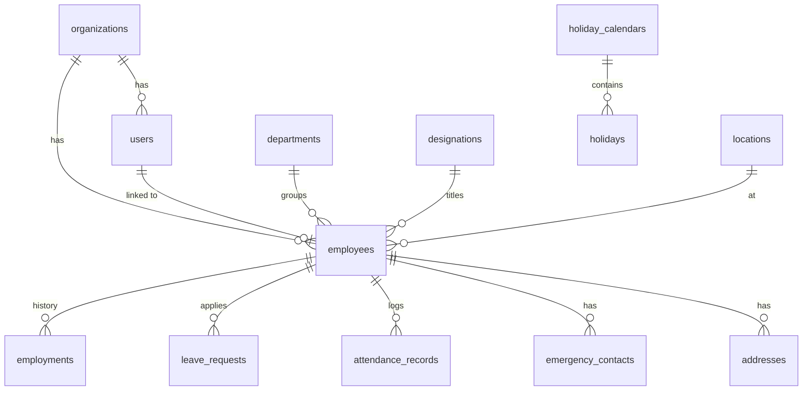

# 02 — Database Design

> **Status:** Phase 2. Defines every table, column, constraint, relationship, index, and seed needed for Phase 1. The API spec (`03`) references entities by the exact names declared here.

---

## 1. Conventions

### 1.1 Naming

- **Tables:** plural `snake_case` (`employees`, `leave_requests`, `attendance_records`).
- **Columns:** singular `snake_case` (`first_name`, `created_at`).
- **Booleans:** prefixed `is_`, `has_`, `can_` (`is_required`, `has_acknowledgment`).
- **Timestamps:** `*_at` (`created_at`, `published_at`, `verified_at`).
- **Foreign keys:** `<table_singular>_id` (`employee_id`, `leave_type_id`).
- **Join tables:** `<a>_<b>` alphabetical (`role_permissions`).
- **Enums:** Postgres native `ENUM` types; names singular `snake_case` (`employee_status`, `leave_request_status`).

### 1.2 Primary keys

- **`uuid` (v7 — time-sortable)** for all PKs. Column name `id`.
- Generated server-side via Prisma `@default(dbgenerated("uuid_generate_v7()"))` — `pg_uuidv7` extension assumed enabled.

### 1.3 Standard columns (every domain table)

| Column | Type | Default | Notes |
|---|---|---|---|
| `id` | `uuid` | `uuid_generate_v7()` | PK. |
| `organization_id` | `uuid` | — | FK → `organizations.id`. Required on every domain table (tenancy). |
| `created_at` | `timestamptz` | `now()` | Set on insert. |
| `updated_at` | `timestamptz` | `now()` | Updated by trigger on every row change. |
| `deleted_at` | `timestamptz` | `NULL` | Soft delete marker. `NULL` = active. |
| `created_by` | `uuid` | `NULL` | FK → `users.id` (nullable for system-created rows). |
| `updated_by` | `uuid` | `NULL` | FK → `users.id`. |

Tables that are *tenant-bound* (everything except `organizations`, `permissions`, and `audit_logs` — audit_logs has its own tenant column with no soft delete) carry **all** of the above. Lookup-only configuration tables (e.g., `permissions`) may omit `organization_id`, `deleted_at`, `created_by`, and `updated_by` — explicit overrides are flagged on each table below.

### 1.4 Soft delete semantics

- `deleted_at` set when a record is "deleted"; record remains queryable for audit and historical reads.
- All read queries default to `deleted_at IS NULL` via a Prisma extension; admin export endpoints may opt out.
- A **purge job** runs nightly and hard-deletes rows where `deleted_at < now() - interval '30 days'` for tenants that have opted into "permanent delete after 30 days" (default ON, configurable per org).

### 1.5 Multi-tenancy

- **Shared-DB / row-scoped** model in Phase 1. Every domain table has `organization_id NOT NULL`.
- A `TenantContext` is resolved per request from the JWT and injected into a Prisma extension that:
  1. Auto-filters every `findMany` / `findUnique` / `count` / `update` / `delete` with `where: { organization_id: ctx.organizationId }`.
  2. Auto-sets `organization_id` on `create`.
  3. Throws `TenantBoundaryViolation` if any explicit `where` includes a different `organization_id`.
- For the **future dedicated-DB tier** (per `00 § 8.2` and the architecture in `08`), the tenant resolver is swapped to pick a DB connection by `organization_id`; the rest of the data layer is unchanged.
- **Composite indexes** on `(organization_id, *)` for every column we filter or sort by (see § 4).

### 1.6 Timestamps & timezone

- All `timestamptz` stored UTC.
- `date` (no time) used for calendar concepts: `leave_requests.start_date`, `holidays.observed_on`, `employees.date_of_birth`.

### 1.7 Money & numerics

- Currency stored as `numeric(18,2)` plus a sibling `*_currency CHAR(3)` (ISO 4217).
- Counts as `integer`; percentages as `numeric(5,2)`.

### 1.8 JSON

- Variable / extensible fields use `jsonb`. Each such column documents its expected shape and is validated server-side via Zod before insert.

### 1.9 Constraints we always add

- `NOT NULL` unless a column is genuinely optional.
- `CHECK` for finite enums when not using a Postgres ENUM (used sparingly; prefer ENUMs).
- `UNIQUE` indexes scoped by `organization_id` for fields that are unique-within-tenant.
- `ON DELETE` set to:
  - `RESTRICT` for human references the user shouldn't be able to orphan (e.g., `leave_requests.employee_id`).
  - `CASCADE` for ownership relationships (e.g., `leave_balances → leave_types`).
  - `SET NULL` for soft references (e.g., `employees.manager_id`).

### 1.10 Migrations

- Prisma migrations under `apps/api/prisma/migrations/`.
- Naming: `YYYYMMDDHHMM_<kebab-case-description>`.
- Forward-only; every migration is paired with a rollback note in the PR.
- Never destructive in a single migration step on a tenant-shared table (expand/contract pattern: add → backfill → switch → drop).

---

## 2. Entity Catalog

> Every entity is presented as: brief purpose, the field table (name, type, nullable, default, notes), indexes, and notable constraints. Standard columns (§ 1.3) are listed once at the bottom of each table for brevity.

### 2.1 Identity, tenancy & RBAC

#### 2.1.1 `organizations`

The customer org. Top-level isolation boundary.

| Field | Type | Null | Default | Notes |
|---|---|---|---|---|
| `id` | `uuid` | no | `uuid_generate_v7()` | PK |
| `name` | `varchar(120)` | no |  | Display name |
| `slug` | `varchar(60)` | no |  | URL-safe, globally unique |
| `legal_name` | `varchar(180)` | yes |  |  |
| `domain` | `varchar(180)` | yes |  | Optional primary email domain (used for auto-assign hints — never enforces sign-in) |
| `logo_url` | `text` | yes |  | S3 key |
| `primary_color` | `varchar(9)` | yes | `#0F172A` | Hex with optional alpha |
| `timezone` | `varchar(64)` | no | `Etc/UTC` | IANA tz (e.g., `Asia/Kolkata`) |
| `locale` | `varchar(16)` | no | `en-US` |  |
| `currency` | `char(3)` | no | `USD` | ISO 4217 |
| `week_start` | `smallint` | no | `1` | 0=Sun … 6=Sat |
| `billing_email` | `varchar(254)` | yes |  |  |
| `plan` | `org_plan` ENUM | no | `'trial'` | `trial`, `starter`, `growth`, `enterprise` |
| `status` | `org_status` ENUM | no | `'active'` | `active`, `suspended`, `cancelled` |
| `trial_ends_at` | `timestamptz` | yes |  |  |
| `settings_version` | `integer` | no | `1` | Used to invalidate cached `org_settings` |
| _standard cols_ | | | | omits `organization_id`; otherwise as § 1.3 |

- **Unique:** `slug` (global), `domain` (global, partial where not null).
- **Indexes:** `(status)`, `(plan)`.

#### 2.1.2 `org_settings`

Key/value config per org. Versioned by `organizations.settings_version`.

| Field | Type | Null | Default | Notes |
|---|---|---|---|---|
| `organization_id` | `uuid` | no |  | PK with `key` |
| `key` | `varchar(100)` | no |  | e.g., `attendance.late_threshold_minutes` |
| `value` | `jsonb` | no |  | Schema validated per-key server-side |

- **PK:** `(organization_id, key)`.
- All other standard cols apply except `id` is replaced by composite PK; `deleted_at` is NULL only — we hard-delete settings.

#### 2.1.3 `users`

Auth principal.

| Field | Type | Null | Default | Notes |
|---|---|---|---|---|
| `id` | `uuid` | no | `uuid_generate_v7()` | PK |
| `organization_id` | `uuid` | no |  | FK |
| `email` | `varchar(254)` | no |  | Normalized lowercase |
| `email_verified_at` | `timestamptz` | yes |  |  |
| `password_hash` | `text` | yes |  | argon2id; null only during invite |
| `status` | `user_status` ENUM | no | `'invited'` | `invited`, `active`, `disabled` |
| `invite_token_hash` | `varchar(128)` | yes |  | SHA-256 of token, null after accept |
| `invite_token_expires_at` | `timestamptz` | yes |  |  |
| `two_factor_enabled` | `boolean` | no | `false` |  |
| `two_factor_secret_enc` | `text` | yes |  | AES-GCM encrypted TOTP secret |
| `two_factor_recovery_codes_enc` | `text` | yes |  | JSON array, encrypted |
| `last_login_at` | `timestamptz` | yes |  |  |
| `last_login_ip` | `inet` | yes |  |  |
| `failed_login_count` | `integer` | no | `0` |  |
| `locked_until` | `timestamptz` | yes |  |  |
| `default_portal` | `portal` ENUM | no | `'employee'` | `admin`, `employee` |
| `preferences` | `jsonb` | no | `'{}'` | theme, notification opt-outs, locale override |
| _standard cols_ |  |  |  |  |

- **Unique:** `(organization_id, lower(email))` and **global** `lower(email)` (a person belongs to one org at a time in Phase 1).
- **Indexes:** `(organization_id, status)`, `(invite_token_hash)`.

#### 2.1.4 `refresh_tokens`

Issued tokens (rotation chain).

| Field | Type | Null | Default | Notes |
|---|---|---|---|---|
| `id` | `uuid` | no |  |  |
| `organization_id` | `uuid` | no |  |  |
| `user_id` | `uuid` | no |  | FK |
| `token_hash` | `char(64)` | no |  | SHA-256 hex |
| `parent_id` | `uuid` | yes |  | Previous rotated token; null for root |
| `user_agent` | `text` | yes |  |  |
| `ip_address` | `inet` | yes |  |  |
| `issued_at` | `timestamptz` | no | `now()` |  |
| `expires_at` | `timestamptz` | no |  |  |
| `revoked_at` | `timestamptz` | yes |  | Set on rotation or explicit logout |
| `revoke_reason` | `varchar(40)` | yes |  | `rotated`, `logout`, `password_change`, `admin_force` |

- **Unique:** `token_hash`.
- **Indexes:** `(user_id, revoked_at)`, `(expires_at)` (cleanup job).

#### 2.1.5 `roles`

Org-scoped roles.

| Field | Type | Null | Default | Notes |
|---|---|---|---|---|
| `id` | `uuid` | no |  |  |
| `organization_id` | `uuid` | no |  |  |
| `key` | `varchar(40)` | no |  | `super_admin`, `hr_admin`, `manager`, `employee`, or custom |
| `name` | `varchar(80)` | no |  | Display |
| `description` | `text` | yes |  |  |
| `is_system` | `boolean` | no | `false` | True for seeded defaults — cannot be deleted |
| _standard cols_ |  |  |  |  |

- **Unique:** `(organization_id, key)`.

#### 2.1.6 `permissions`

Global catalog (not tenant-scoped). Defined in `01 § 10.2`.

| Field | Type | Null | Default | Notes |
|---|---|---|---|---|
| `key` | `varchar(80)` | no |  | PK; e.g., `employee.read` |
| `resource` | `varchar(40)` | no |  | `employee` |
| `action` | `varchar(40)` | no |  | `read` |
| `description` | `text` | no |  |  |

- Omits `organization_id`, `deleted_at`, `created_by`, `updated_by`; keeps `created_at`, `updated_at`.

#### 2.1.7 `role_permissions`

| Field | Type | Null | Default | Notes |
|---|---|---|---|---|
| `organization_id` | `uuid` | no |  |  |
| `role_id` | `uuid` | no |  | FK |
| `permission_key` | `varchar(80)` | no |  | FK → `permissions.key` |
| `scope` | `permission_scope` ENUM | no | `'global'` | `global`, `team`, `self`, `assigned` |

- **PK:** `(role_id, permission_key)`.

#### 2.1.8 `user_roles`

| Field | Type | Null | Default | Notes |
|---|---|---|---|---|
| `organization_id` | `uuid` | no |  |  |
| `user_id` | `uuid` | no |  |  |
| `role_id` | `uuid` | no |  |  |
| `assigned_at` | `timestamptz` | no | `now()` |  |
| `assigned_by` | `uuid` | yes |  |  |

- **PK:** `(user_id, role_id)`.

#### 2.1.9 `audit_logs`

Append-only.

| Field | Type | Null | Default | Notes |
|---|---|---|---|---|
| `id` | `uuid` | no |  |  |
| `organization_id` | `uuid` | no |  |  |
| `actor_user_id` | `uuid` | yes |  | Null = system action |
| `actor_ip` | `inet` | yes |  |  |
| `action` | `varchar(80)` | no |  | e.g., `employee.create` |
| `resource_type` | `varchar(40)` | no |  | `employee` |
| `resource_id` | `uuid` | yes |  |  |
| `before` | `jsonb` | yes |  |  |
| `after` | `jsonb` | yes |  |  |
| `metadata` | `jsonb` | no | `'{}'` | Request id, route, latency |
| `created_at` | `timestamptz` | no | `now()` |  |

- **Indexes:** `(organization_id, created_at desc)`, `(resource_type, resource_id)`, `(action)`.
- **No** `updated_at`, `deleted_at` — immutable. Partitioned monthly by `created_at` once table > 50M rows (Phase 2 trigger).

#### 2.1.10 `notifications`

In-app notifications.

| Field | Type | Null | Default | Notes |
|---|---|---|---|---|
| `id` | `uuid` | no |  |  |
| `organization_id` | `uuid` | no |  |  |
| `user_id` | `uuid` | no |  | Recipient |
| `template_id` | `varchar(40)` | no |  | e.g., `tpl.leave.approved` (catalog in `01 § 14`) |
| `payload` | `jsonb` | no | `'{}'` | Template variables |
| `link_to` | `text` | yes |  | Deep-link path in the portal |
| `priority` | `notification_priority` ENUM | no | `'normal'` | `low`, `normal`, `high` |
| `read_at` | `timestamptz` | yes |  |  |
| _standard cols_ |  |  |  | (no soft-delete; user can clear) |

- **Indexes:** `(organization_id, user_id, read_at)`, `(created_at desc)`.

#### 2.1.11 `notification_preferences`

| Field | Type | Null | Default | Notes |
|---|---|---|---|---|
| `organization_id` | `uuid` | no |  |  |
| `user_id` | `uuid` | no |  |  |
| `template_id` | `varchar(40)` | no |  |  |
| `email_enabled` | `boolean` | no | `true` |  |
| `inapp_enabled` | `boolean` | no | `true` |  |

- **PK:** `(user_id, template_id)`.

---

### 2.2 People

#### 2.2.1 `employees`

| Field | Type | Null | Default | Notes |
|---|---|---|---|---|
| `id` | `uuid` | no |  |  |
| `organization_id` | `uuid` | no |  |  |
| `user_id` | `uuid` | yes |  | Null until invite accepted (or for record-only employees) |
| `employee_code` | `varchar(32)` | no |  | Human ID; unique within org |
| `first_name` | `varchar(60)` | no |  |  |
| `middle_name` | `varchar(60)` | yes |  |  |
| `last_name` | `varchar(60)` | no |  |  |
| `display_name` | `varchar(120)` | no |  | Computed but persisted |
| `personal_email` | `varchar(254)` | yes |  |  |
| `work_email` | `varchar(254)` | no |  |  |
| `mobile_phone_e164` | `varchar(20)` | yes |  |  |
| `date_of_birth` | `date` | yes |  |  |
| `gender` | `gender` ENUM | yes |  | `male`, `female`, `non_binary`, `prefer_not_to_say`, `other` |
| `nationality` | `char(2)` | yes |  | ISO 3166-1 alpha-2 |
| `marital_status` | `marital_status` ENUM | yes |  | `single`, `married`, `divorced`, `widowed`, `other` |
| `blood_group` | `varchar(3)` | yes |  | `A+`, `O-`, etc. |
| `profile_photo_url` | `text` | yes |  | S3 key |
| `status` | `employee_status` ENUM | no | `'invited'` | `invited`, `active`, `on_leave`, `suspended`, `offboarded` |
| `joined_on` | `date` | yes |  |  |
| `confirmed_on` | `date` | yes |  | End of probation |
| `terminated_on` | `date` | yes |  |  |
| `department_id` | `uuid` | yes |  | FK |
| `designation_id` | `uuid` | yes |  | FK |
| `location_id` | `uuid` | yes |  | FK |
| `manager_id` | `uuid` | yes |  | FK → `employees.id` (self-ref) |
| `employment_type` | `employment_type` ENUM | no | `'full_time'` | `full_time`, `part_time`, `intern`, `contractor`, `consultant` |
| `work_mode` | `work_mode` ENUM | no | `'onsite'` | `onsite`, `hybrid`, `remote` |
| `holiday_calendar_id` | `uuid` | yes |  | FK |
| `attendance_policy_id` | `uuid` | yes |  | FK |
| `timezone_override` | `varchar(64)` | yes |  | Null = use org tz |
| _standard cols_ |  |  |  |  |

- **Unique (within org, soft-delete aware):** `employee_code`, `work_email`, `user_id`.
- **Indexes:** `(organization_id, status)`, `(organization_id, department_id)`, `(organization_id, manager_id)`, `(organization_id, joined_on)`, GIN trigram on `display_name`, `employee_code`, `work_email`.

#### 2.2.2 `employments`

History row per role/title/department change. Current row is the one with `effective_to IS NULL`.

| Field | Type | Null | Default | Notes |
|---|---|---|---|---|
| `id` | `uuid` | no |  |  |
| `organization_id` | `uuid` | no |  |  |
| `employee_id` | `uuid` | no |  |  |
| `effective_from` | `date` | no |  |  |
| `effective_to` | `date` | yes |  |  |
| `designation_id` | `uuid` | yes |  |  |
| `department_id` | `uuid` | yes |  |  |
| `location_id` | `uuid` | yes |  |  |
| `manager_id` | `uuid` | yes |  |  |
| `employment_type` | `employment_type` ENUM | yes |  |  |
| `change_reason` | `text` | yes |  |  |
| _standard cols_ |  |  |  |  |

- **Indexes:** `(employee_id, effective_from desc)`, partial `(employee_id) WHERE effective_to IS NULL`.

#### 2.2.3 `emergency_contacts`

| Field | Type | Null | Default | Notes |
|---|---|---|---|---|
| `id` | `uuid` | no |  |  |
| `organization_id` | `uuid` | no |  |  |
| `employee_id` | `uuid` | no |  |  |
| `name` | `varchar(120)` | no |  |  |
| `relationship` | `varchar(40)` | no |  |  |
| `phone_e164` | `varchar(20)` | no |  |  |
| `phone_alt_e164` | `varchar(20)` | yes |  |  |
| `email` | `varchar(254)` | yes |  |  |
| `is_primary` | `boolean` | no | `false` |  |
| _standard cols_ |  |  |  |  |

- **Index:** `(employee_id, is_primary)`.

#### 2.2.4 `addresses`

| Field | Type | Null | Default | Notes |
|---|---|---|---|---|
| `id` | `uuid` | no |  |  |
| `organization_id` | `uuid` | no |  |  |
| `employee_id` | `uuid` | no |  |  |
| `kind` | `address_kind` ENUM | no |  | `current`, `permanent`, `mailing` |
| `line1` | `varchar(180)` | no |  |  |
| `line2` | `varchar(180)` | yes |  |  |
| `city` | `varchar(80)` | no |  |  |
| `state` | `varchar(80)` | yes |  |  |
| `country` | `char(2)` | no |  | ISO |
| `postal_code` | `varchar(20)` | yes |  |  |
| _standard cols_ |  |  |  |  |

- **Unique:** `(employee_id, kind)` (one of each kind per employee).

---

### 2.3 Org structure

#### 2.3.1 `departments`

| Field | Type | Null | Default | Notes |
|---|---|---|---|---|
| `id` | `uuid` | no |  |  |
| `organization_id` | `uuid` | no |  |  |
| `name` | `varchar(100)` | no |  |  |
| `code` | `varchar(20)` | yes |  | Org-unique short code |
| `parent_id` | `uuid` | yes |  | Self-ref for tree |
| `head_employee_id` | `uuid` | yes |  |  |
| `description` | `text` | yes |  |  |
| _standard cols_ |  |  |  |  |

- **Unique:** `(organization_id, lower(name))`, `(organization_id, code)`.

#### 2.3.2 `designations`

| Field | Type | Null | Default | Notes |
|---|---|---|---|---|
| `id` | `uuid` | no |  |  |
| `organization_id` | `uuid` | no |  |  |
| `name` | `varchar(120)` | no |  |  |
| `level` | `smallint` | yes |  | Career ladder |
| `description` | `text` | yes |  |  |
| _standard cols_ |  |  |  |  |

- **Unique:** `(organization_id, lower(name))`.

#### 2.3.3 `locations`

| Field | Type | Null | Default | Notes |
|---|---|---|---|---|
| `id` | `uuid` | no |  |  |
| `organization_id` | `uuid` | no |  |  |
| `name` | `varchar(120)` | no |  |  |
| `code` | `varchar(20)` | yes |  |  |
| `address_line1` | `varchar(180)` | yes |  |  |
| `address_line2` | `varchar(180)` | yes |  |  |
| `city` | `varchar(80)` | yes |  |  |
| `state` | `varchar(80)` | yes |  |  |
| `country` | `char(2)` | yes |  |  |
| `postal_code` | `varchar(20)` | yes |  |  |
| `timezone` | `varchar(64)` | no | `'Etc/UTC'` |  |
| `holiday_calendar_id` | `uuid` | yes |  | Default cal for employees in this location |
| _standard cols_ |  |  |  |  |

- **Unique:** `(organization_id, lower(name))`.

---

### 2.4 Attendance

#### 2.4.1 `attendance_policies`

| Field | Type | Null | Default | Notes |
|---|---|---|---|---|
| `id` | `uuid` | no |  |  |
| `organization_id` | `uuid` | no |  |  |
| `name` | `varchar(80)` | no |  |  |
| `is_default` | `boolean` | no | `false` |  |
| `work_days` | `smallint[]` | no | `'{1,2,3,4,5}'` | 0=Sun … 6=Sat |
| `expected_hours_per_day` | `numeric(4,2)` | no | `8.00` |  |
| `day_start_time` | `time` | no | `09:00` | Org local time |
| `day_end_time` | `time` | no | `18:00` |  |
| `grace_minutes_late` | `smallint` | no | `15` |  |
| `half_day_threshold_hours` | `numeric(4,2)` | no | `4.00` |  |
| `regularization_window_days` | `smallint` | no | `14` |  |
| `auto_close_at_minutes_after_end` | `smallint` | yes | `120` | Auto-close incomplete days |
| _standard cols_ |  |  |  |  |

- **Unique:** `(organization_id, lower(name))`, and partial `(organization_id) WHERE is_default` ensures at most one default.

#### 2.4.2 `attendance_records`

One row per employee per local date.

| Field | Type | Null | Default | Notes |
|---|---|---|---|---|
| `id` | `uuid` | no |  |  |
| `organization_id` | `uuid` | no |  |  |
| `employee_id` | `uuid` | no |  |  |
| `attendance_date` | `date` | no |  | Local date (resolved using employee tz at write) |
| `check_in_at` | `timestamptz` | yes |  |  |
| `check_out_at` | `timestamptz` | yes |  |  |
| `check_in_ip` | `inet` | yes |  |  |
| `check_out_ip` | `inet` | yes |  |  |
| `check_in_user_agent` | `text` | yes |  |  |
| `check_out_user_agent` | `text` | yes |  |  |
| `worked_minutes` | `integer` | yes |  | Computed |
| `status` | `attendance_status` ENUM | no | `'absent'` | `present`, `half_day`, `absent`, `on_leave`, `holiday`, `weekoff` |
| `is_late` | `boolean` | no | `false` |  |
| `is_regularized` | `boolean` | no | `false` |  |
| `regularization_id` | `uuid` | yes |  |  |
| `notes` | `text` | yes |  |  |
| _standard cols_ |  |  |  |  |

- **Unique:** `(employee_id, attendance_date)`.
- **Indexes:** `(organization_id, attendance_date)`, `(organization_id, status, attendance_date)`.

#### 2.4.3 `attendance_regularization_requests`

| Field | Type | Null | Default | Notes |
|---|---|---|---|---|
| `id` | `uuid` | no |  |  |
| `organization_id` | `uuid` | no |  |  |
| `employee_id` | `uuid` | no |  |  |
| `attendance_record_id` | `uuid` | yes |  | Set on approval if existed prior |
| `attendance_date` | `date` | no |  |  |
| `requested_check_in_at` | `timestamptz` | yes |  |  |
| `requested_check_out_at` | `timestamptz` | yes |  |  |
| `reason` | `text` | no |  |  |
| `status` | `regularization_status` ENUM | no | `'pending'` | `pending`, `approved`, `rejected`, `cancelled` |
| `decided_by` | `uuid` | yes |  |  |
| `decided_at` | `timestamptz` | yes |  |  |
| `decision_comment` | `text` | yes |  |  |
| _standard cols_ |  |  |  |  |

- **Indexes:** `(organization_id, status, created_at desc)`, `(employee_id, attendance_date)`.

---

### 2.5 Leave

#### 2.5.1 `leave_types`

| Field | Type | Null | Default | Notes |
|---|---|---|---|---|
| `id` | `uuid` | no |  |  |
| `organization_id` | `uuid` | no |  |  |
| `name` | `varchar(80)` | no |  |  |
| `code` | `varchar(20)` | no |  | `CL`, `SL`, `EL`, … |
| `color` | `varchar(9)` | no | `#94A3B8` |  |
| `unit` | `leave_unit` ENUM | no | `'day'` | `day`, `half_day`, `hour` |
| `accrual_type` | `accrual_type` ENUM | no | `'annual'` | `annual`, `monthly`, `quarterly`, `none` |
| `accrual_amount` | `numeric(6,2)` | no | `0` | Per period (units) |
| `max_balance` | `numeric(6,2)` | yes |  | Cap |
| `carry_forward_max` | `numeric(6,2)` | yes |  | Days carried to next cycle |
| `min_request_units` | `numeric(6,2)` | no | `0.5` |  |
| `max_request_units` | `numeric(6,2)` | yes |  | Per request |
| `notice_days_required` | `smallint` | no | `0` |  |
| `is_paid` | `boolean` | no | `true` |  |
| `requires_approval` | `boolean` | no | `true` |  |
| `requires_attachment_after_days` | `smallint` | yes |  | e.g., sick > 2 days |
| `gender_restriction` | `gender` ENUM | yes |  |  |
| `applies_after_days_of_service` | `smallint` | yes |  |  |
| `is_active` | `boolean` | no | `true` |  |
| `description` | `text` | yes |  |  |
| _standard cols_ |  |  |  |  |

- **Unique:** `(organization_id, lower(name))`, `(organization_id, code)`.

#### 2.5.2 `leave_policies`

Per-employee or per-role overrides for a leave type. Phase 1: org-wide defaults via `leave_types` directly; this table reserved for Phase 2 overrides (kept for forward compat).

| Field | Type | Null | Default | Notes |
|---|---|---|---|---|
| `id` | `uuid` | no |  |  |
| `organization_id` | `uuid` | no |  |  |
| `leave_type_id` | `uuid` | no |  |  |
| `scope_kind` | `policy_scope` ENUM | no |  | `employment_type`, `location`, `department`, `employee` |
| `scope_value` | `varchar(120)` | no |  | Stringified id or enum value |
| `override_json` | `jsonb` | no |  | Field-level overrides |
| _standard cols_ |  |  |  |  |

- **Index:** `(organization_id, leave_type_id, scope_kind)`.

#### 2.5.3 `leave_balances`

Aggregated current balance per (employee, type, year).

| Field | Type | Null | Default | Notes |
|---|---|---|---|---|
| `id` | `uuid` | no |  |  |
| `organization_id` | `uuid` | no |  |  |
| `employee_id` | `uuid` | no |  |  |
| `leave_type_id` | `uuid` | no |  |  |
| `period_year` | `smallint` | no |  |  |
| `opening` | `numeric(6,2)` | no | `0` | Carried forward |
| `accrued` | `numeric(6,2)` | no | `0` |  |
| `used` | `numeric(6,2)` | no | `0` | Approved + completed |
| `reserved` | `numeric(6,2)` | no | `0` | Pending requests |
| `adjusted` | `numeric(6,2)` | no | `0` | Manual admin tweaks |
| `available` | `numeric(6,2)` | no | `0` | Computed = opening + accrued − used − reserved + adjusted |
| _standard cols_ |  |  |  |  |

- **Unique:** `(employee_id, leave_type_id, period_year)`.

#### 2.5.4 `leave_ledger`

Append-only event log for balance changes — the truth from which `leave_balances` is derived.

| Field | Type | Null | Default | Notes |
|---|---|---|---|---|
| `id` | `uuid` | no |  |  |
| `organization_id` | `uuid` | no |  |  |
| `employee_id` | `uuid` | no |  |  |
| `leave_type_id` | `uuid` | no |  |  |
| `period_year` | `smallint` | no |  |  |
| `entry_type` | `leave_ledger_entry` ENUM | no |  | `opening`, `accrual`, `reserve`, `unreserve`, `deduct`, `refund`, `adjust`, `expire` |
| `units` | `numeric(6,2)` | no |  | Signed |
| `leave_request_id` | `uuid` | yes |  |  |
| `note` | `text` | yes |  |  |
| `created_at` | `timestamptz` | no | `now()` |  |
| `created_by` | `uuid` | yes |  |  |

- Immutable, no `updated_at` / `deleted_at`.
- **Indexes:** `(employee_id, leave_type_id, period_year, created_at)`, `(leave_request_id)`.

#### 2.5.5 `leave_requests`

| Field | Type | Null | Default | Notes |
|---|---|---|---|---|
| `id` | `uuid` | no |  |  |
| `organization_id` | `uuid` | no |  |  |
| `employee_id` | `uuid` | no |  |  |
| `leave_type_id` | `uuid` | no |  |  |
| `start_date` | `date` | no |  |  |
| `end_date` | `date` | no |  |  |
| `is_half_day_start` | `boolean` | no | `false` |  |
| `is_half_day_end` | `boolean` | no | `false` |  |
| `requested_units` | `numeric(6,2)` | no |  | Computed against working days × policy |
| `reason` | `text` | yes |  |  |
| `contact_during_leave` | `text` | yes |  |  |
| `attachment_url` | `text` | yes |  |  |
| `status` | `leave_request_status` ENUM | no | `'pending'` | `pending`, `approved`, `rejected`, `cancelled`, `withdrawn` |
| `decided_by` | `uuid` | yes |  |  |
| `decided_at` | `timestamptz` | yes |  |  |
| `decision_comment` | `text` | yes |  |  |
| `submitted_at` | `timestamptz` | no | `now()` |  |
| _standard cols_ |  |  |  |  |

- `CHECK (start_date <= end_date)`.
- **Indexes:** `(organization_id, status, submitted_at desc)`, `(employee_id, start_date)`, GiST exclusion (Phase 2) to prevent overlapping approved leaves per employee.

#### 2.5.6 `leave_approval_history`

Each state transition.

| Field | Type | Null | Default | Notes |
|---|---|---|---|---|
| `id` | `uuid` | no |  |  |
| `organization_id` | `uuid` | no |  |  |
| `leave_request_id` | `uuid` | no |  |  |
| `from_status` | `leave_request_status` ENUM | yes |  |  |
| `to_status` | `leave_request_status` ENUM | no |  |  |
| `actor_user_id` | `uuid` | yes |  |  |
| `comment` | `text` | yes |  |  |
| `created_at` | `timestamptz` | no | `now()` |  |

- Immutable.

---

### 2.6 Documents

#### 2.6.1 `document_categories`

| Field | Type | Null | Default | Notes |
|---|---|---|---|---|
| `id` | `uuid` | no |  |  |
| `organization_id` | `uuid` | no |  |  |
| `name` | `varchar(80)` | no |  |  |
| `description` | `text` | yes |  |  |
| `is_personal` | `boolean` | no | `false` | True = lives under each employee's profile (e.g., "Offer Letter") |
| `is_system` | `boolean` | no | `false` |  |
| _standard cols_ |  |  |  |  |

- **Unique:** `(organization_id, lower(name))`.

#### 2.6.2 `documents`

| Field | Type | Null | Default | Notes |
|---|---|---|---|---|
| `id` | `uuid` | no |  |  |
| `organization_id` | `uuid` | no |  |  |
| `category_id` | `uuid` | no |  |  |
| `title` | `varchar(180)` | no |  |  |
| `description` | `text` | yes |  |  |
| `file_url` | `text` | no |  | S3 key |
| `file_name` | `varchar(255)` | no |  |  |
| `file_size_bytes` | `bigint` | no |  |  |
| `file_mime_type` | `varchar(120)` | no |  |  |
| `version` | `integer` | no | `1` |  |
| `is_required` | `boolean` | no | `false` |  |
| `due_by` | `date` | yes |  |  |
| `is_personal` | `boolean` | no | `false` | Personal docs target a single employee |
| `subject_employee_id` | `uuid` | yes |  | For personal docs (e.g., the offer letter belongs to employee X) |
| `published_at` | `timestamptz` | yes |  | Null = draft |
| `expires_at` | `timestamptz` | yes |  |  |
| _standard cols_ |  |  |  |  |

- **Indexes:** `(organization_id, category_id)`, `(organization_id, published_at desc)`, `(subject_employee_id)`.
- **Constraint:** `CHECK ((is_personal AND subject_employee_id IS NOT NULL) OR (NOT is_personal))`.

#### 2.6.3 `document_audiences`

Targets for distributed (non-personal) docs.

| Field | Type | Null | Default | Notes |
|---|---|---|---|---|
| `id` | `uuid` | no |  |  |
| `organization_id` | `uuid` | no |  |  |
| `document_id` | `uuid` | no |  |  |
| `audience_kind` | `audience_kind` ENUM | no |  | `all_employees`, `department`, `location`, `designation`, `employment_type`, `employee` |
| `audience_value` | `varchar(80)` | yes |  | id or enum, null when `all_employees` |

- **Indexes:** `(document_id)`, `(organization_id, audience_kind, audience_value)`.

#### 2.6.4 `document_acknowledgments`

| Field | Type | Null | Default | Notes |
|---|---|---|---|---|
| `id` | `uuid` | no |  |  |
| `organization_id` | `uuid` | no |  |  |
| `document_id` | `uuid` | no |  |  |
| `employee_id` | `uuid` | no |  |  |
| `acknowledged_at` | `timestamptz` | no | `now()` |  |
| `ip_address` | `inet` | yes |  |  |
| `user_agent` | `text` | yes |  |  |

- **Unique:** `(document_id, employee_id)`.
- **Indexes:** `(employee_id, acknowledged_at desc)`.

---

### 2.7 Announcements

#### 2.7.1 `announcements`

| Field | Type | Null | Default | Notes |
|---|---|---|---|---|
| `id` | `uuid` | no |  |  |
| `organization_id` | `uuid` | no |  |  |
| `title` | `varchar(180)` | no |  |  |
| `body_html` | `text` | no |  | Sanitized rich text |
| `cover_image_url` | `text` | yes |  |  |
| `pinned` | `boolean` | no | `false` |  |
| `requires_acknowledgment` | `boolean` | no | `false` |  |
| `published_at` | `timestamptz` | yes |  | Null = draft |
| `scheduled_for` | `timestamptz` | yes |  | If set, publish job picks it up |
| `expires_at` | `timestamptz` | yes |  |  |
| `priority` | `announcement_priority` ENUM | no | `'normal'` | `low`, `normal`, `high` |
| `status` | `announcement_status` ENUM | no | `'draft'` | `draft`, `scheduled`, `published`, `archived` |
| _standard cols_ |  |  |  |  |

- **Indexes:** `(organization_id, status, published_at desc)`, `(organization_id, scheduled_for)` partial where scheduled.

#### 2.7.2 `announcement_audiences`

Same shape as `document_audiences` but FK to `announcements`.

#### 2.7.3 `announcement_acknowledgments`

Same shape as `document_acknowledgments`, FK to `announcements`. **Unique** `(announcement_id, employee_id)`.

---

### 2.8 Holidays

#### 2.8.1 `holiday_calendars`

| Field | Type | Null | Default | Notes |
|---|---|---|---|---|
| `id` | `uuid` | no |  |  |
| `organization_id` | `uuid` | no |  |  |
| `name` | `varchar(80)` | no |  |  |
| `country` | `char(2)` | yes |  |  |
| `region` | `varchar(60)` | yes |  | State/province |
| `is_default` | `boolean` | no | `false` |  |
| `description` | `text` | yes |  |  |
| _standard cols_ |  |  |  |  |

- **Unique:** `(organization_id, lower(name))`, partial `(organization_id) WHERE is_default`.

#### 2.8.2 `holidays`

| Field | Type | Null | Default | Notes |
|---|---|---|---|---|
| `id` | `uuid` | no |  |  |
| `organization_id` | `uuid` | no |  |  |
| `holiday_calendar_id` | `uuid` | no |  |  |
| `name` | `varchar(120)` | no |  |  |
| `observed_on` | `date` | no |  |  |
| `kind` | `holiday_kind` ENUM | no | `'public'` | `public`, `optional`, `restricted`, `company` |
| `is_optional` | `boolean` | no | `false` |  |
| `description` | `text` | yes |  |  |
| _standard cols_ |  |  |  |  |

- **Unique:** `(holiday_calendar_id, observed_on, lower(name))`.
- **Indexes:** `(organization_id, observed_on)`.

#### 2.8.3 `holiday_calendar_assignments`

Assigns calendars to a scope. Resolution: employee assignment > location default > org default.

| Field | Type | Null | Default | Notes |
|---|---|---|---|---|
| `id` | `uuid` | no |  |  |
| `organization_id` | `uuid` | no |  |  |
| `holiday_calendar_id` | `uuid` | no |  |  |
| `scope_kind` | `holiday_scope` ENUM | no |  | `organization`, `location`, `department`, `employee` |
| `scope_value` | `uuid` | yes |  | Null when `organization` |
| _standard cols_ |  |  |  |  |

- **Unique:** `(scope_kind, scope_value)` per org.

---

## 3. Enumerations (canonical list)

```
org_plan: trial | starter | growth | enterprise
org_status: active | suspended | cancelled
user_status: invited | active | disabled
portal: admin | employee
permission_scope: global | team | self | assigned
employee_status: invited | active | on_leave | suspended | offboarded
employment_type: full_time | part_time | intern | contractor | consultant
work_mode: onsite | hybrid | remote
gender: male | female | non_binary | prefer_not_to_say | other
marital_status: single | married | divorced | widowed | other
address_kind: current | permanent | mailing
attendance_status: present | half_day | absent | on_leave | holiday | weekoff
regularization_status: pending | approved | rejected | cancelled
leave_unit: day | half_day | hour
accrual_type: annual | monthly | quarterly | none
policy_scope: employment_type | location | department | employee
leave_ledger_entry: opening | accrual | reserve | unreserve | deduct | refund | adjust | expire
leave_request_status: pending | approved | rejected | cancelled | withdrawn
audience_kind: all_employees | department | location | designation | employment_type | employee
holiday_kind: public | optional | restricted | company
holiday_scope: organization | location | department | employee
announcement_status: draft | scheduled | published | archived
announcement_priority: low | normal | high
notification_priority: low | normal | high
```

---

## 4. Relationships (textual ER)

```
organizations
  ├─< org_settings
  ├─< users ─< user_roles >─ roles ─< role_permissions >─ permissions(global)
  ├─< refresh_tokens
  ├─< audit_logs
  ├─< notifications ─< notification_preferences
  ├─< departments (self ref via parent_id)
  ├─< designations
  ├─< locations
  ├─< employees ──┬─< employments
  │               ├─< emergency_contacts
  │               ├─< addresses
  │               ├─< attendance_records ─< attendance_regularization_requests
  │               ├─< leave_requests ─< leave_approval_history
  │               ├─< leave_balances
  │               ├─< leave_ledger
  │               ├─< document_acknowledgments
  │               ├─< announcement_acknowledgments
  │               └── self-ref via manager_id
  ├─< leave_types ─< leave_policies, leave_balances, leave_requests, leave_ledger
  ├─< attendance_policies
  ├─< document_categories ─< documents ─< document_audiences, document_acknowledgments
  ├─< announcements ─< announcement_audiences, announcement_acknowledgments
  └─< holiday_calendars ─< holidays
                       ─< holiday_calendar_assignments
```

A Mermaid ER fragment for the core people graph (rendered in viewers that support it):



---

## 5. Indexing Strategy

Every domain table starts with a baseline composite `(organization_id, id)` (the natural PK pattern under shared-DB tenancy). Additional indexes listed per entity above. General rules:

- **Lookups by tenant + status + recency** → `(organization_id, status, created_at desc)` (used by request inboxes).
- **Foreign-key columns** that filter listings → indexed (e.g., `employees.department_id`).
- **Text search** on names → trigram (`pg_trgm`) GIN: `employees.display_name`, `employees.employee_code`, `documents.title`, `announcements.title`.
- **Date-range queries** (calendars, leave overlap) → `(organization_id, start_date, end_date)`.
- **Partial indexes** for hot subsets: `WHERE deleted_at IS NULL`, `WHERE status = 'pending'` on requests tables.

---

## 6. Triggers & Functions

- `set_updated_at()` trigger on every domain table: sets `updated_at = now()` on `UPDATE`.
- `enforce_tenant_consistency()`: optional Postgres-side guard that asserts `NEW.organization_id` matches `current_setting('app.org_id', true)` when the API sets it per connection — defense in depth on top of the Prisma extension.
- `leave_balance_recompute(employee_id, leave_type_id, year)` function: aggregates `leave_ledger` rows to upsert `leave_balances`; called after every ledger insert by the API.
- `attendance_auto_close()` scheduled function: marks unclosed attendance rows complete past `auto_close_at_minutes_after_end`.

---

## 7. Seed Data

Loaded once per new organization on signup, via `OrgBootstrapService`.

### 7.1 Roles

```
super_admin   — system, owner role
hr_admin      — system
manager       — system (placeholder)
employee      — system, assigned to every new employee
```

### 7.2 Role → Permissions

The exact assignments mirror the matrix in `01 § 10.3`. The seed script reads from a single source-of-truth JSON in `apps/api/src/seeds/role-permissions.json` and inserts on org creation.

### 7.3 Default leave types (configurable; pre-filled to be edited)

| Code | Name | Accrual | Days/yr | Carry-forward |
|---|---|---|---|---|
| CL | Casual Leave | annual | 12 | 0 |
| SL | Sick Leave | annual | 10 | 0 |
| EL | Earned / Annual Leave | monthly | 1.75 (≈21/yr) | 15 |
| ML | Maternity Leave | none | 0 (request-based) | n/a |
| PL | Paternity Leave | none | 0 (request-based) | n/a |
| LOP | Loss of Pay | none | unlimited (unpaid) | n/a |

### 7.4 Default document categories

`Offer Letter` (personal), `Appointment Letter` (personal), `ID Proof` (personal), `Address Proof` (personal), `Policies & Handbook` (org), `Compliance` (org), `Training` (org).

### 7.5 Default holiday calendar

A "Default" empty calendar with `is_default=true`. A CSV importer ships sample calendars for India and US the admin can import via `/holidays/calendars/[id]/import`.

### 7.6 Default attendance policy

`name='Standard 9-to-6'`, weekdays Mon–Fri, 8 expected hours, 15 min grace, 14-day regularization window.

### 7.7 Default org settings

```
attendance.late_threshold_minutes: 15
attendance.auto_close_at_minutes_after_end: 120
leave.year_start: { month: 1, day: 1 }
leave.notice_required_for_unpaid: false
documents.max_file_size_mb: 25
notifications.digest_time_local: "09:00"
purge.soft_delete_days: 30
```

---

## 8. Tenant-Isolation Tests (assertions)

To be implemented in `apps/api/test/tenant/*.spec.ts`:

1. Two tenants A & B; A's admin token cannot read any row created by B (404 on direct id GET; empty list on filtered).
2. A cannot reference B's foreign keys in any create/update (e.g., create employee in A pointing to department of B → 422 / domain error).
3. Bulk endpoints (`/employees/import`) reject rows referencing other tenants by id.
4. Prisma extension blocks explicit `where: { organization_id: 'other' }`.
5. Audit log entries for tenant A never appear in tenant B reads.
6. Cleanup/purge jobs operate per-tenant; never delete cross-tenant rows.

---

## 9. Storage & Capacity Targets

- Phase 1 sizing target: 1000 tenants × 200 employees avg = 200 k employees.
- `attendance_records` is the largest table: ~200 k employees × ~22 working days × 12 months = ~52 M rows/year. Partition by month from day one.
- `audit_logs`: partition by month once > 50 M rows.
- All others projected < 10 M rows in Phase 1.

---

## 10. Backward-Compatible Evolution

Changes that may happen in early operation and how to do them safely:

| Change | Approach |
|---|---|
| Add column with default | Single migration; safe. |
| Drop column | Two-phase: stop writing → release → next migration drops. |
| Rename column | Add new, dual-write, backfill, switch reads, drop old. |
| Change enum value | Add value (Postgres ALTER TYPE), migrate references, never remove without two releases. |
| Reshape relationship | Add new FK column → backfill → flip code → drop old. |
| Tenant-isolation tweak | Always behind feature flag, with audit-mode logging before enforce. |

---

## 11. Cross-Reference

- Entities here are referenced by endpoint shapes in `03-api-specification.md`.
- Permissions are seeded from `01-information-architecture.md § 10.2`.
- Multi-tenant resolution and Prisma extension detailed in `08-technical-architecture.md § Database`.
